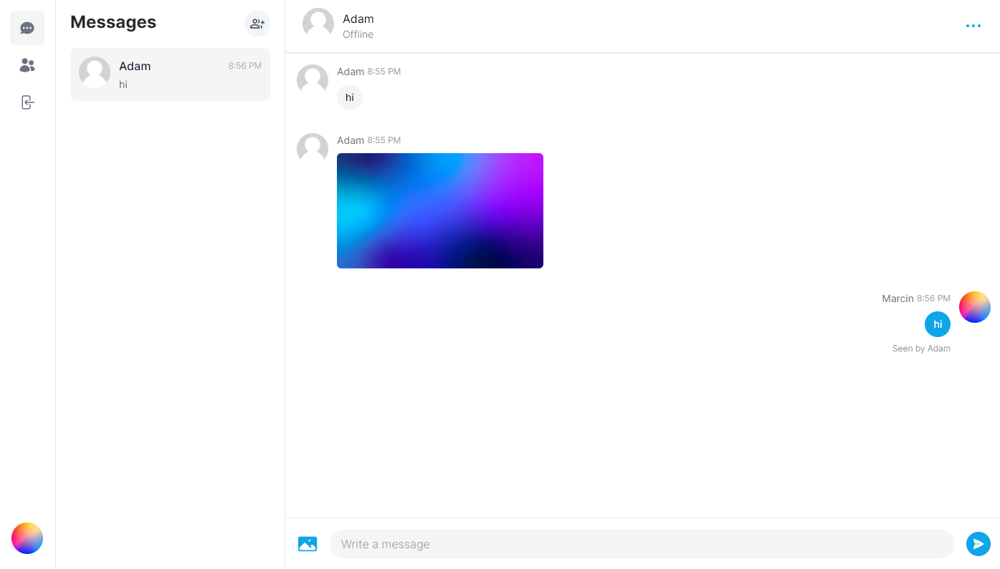

# Messenger Clone

## Table of contents
* [General info](#general-info)
* [Technologies](#technologies)
* [Getting Started](#getting-started)

## General info
This project is a clone of the well-known messenger application created with [Next.js](https://nextjs.org/) and bootstrapped with [`create-next-app`](https://github.com/vercel/next.js/tree/canary/packages/create-next-app). This project includes features such as:
* sending and receiving text messages and images in real time thanks to Pusher
* Google and Github authentication
* login and registration using email and password
* user activity indicator
* group chats
* chat details available after clicking on ellipsis at the top right, where you can see user data and delete the chat
* mini settings available after clicking on our avatar at the bottom left, where you can change the avatar and name

You can see the project [here](https://messenger-clone-flax-five.vercel.app/).



## Technologies
* Next.js v13.4.1
* React v18.2
* TypeScript
* Prisma
* MongoDB
* Axios
* Tailwind CSS
* ESLint
* Pusher
* react-hook-form
* react-hot-toast
* react-icons
* react-select
* zustand

## Getting Started

First, run the development server:

```bash
npm run dev
# or
yarn dev
# or
pnpm dev
```

Open [http://localhost:3000](http://localhost:3000) with your browser to see the result.